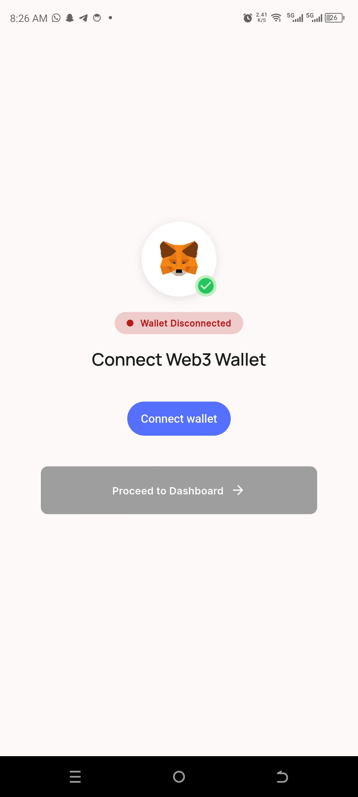
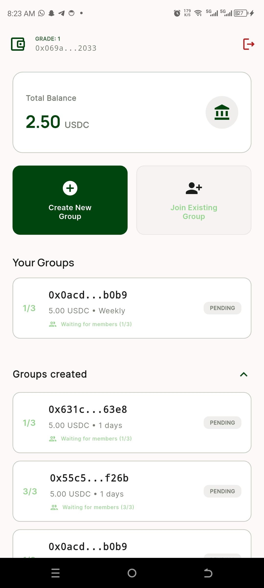
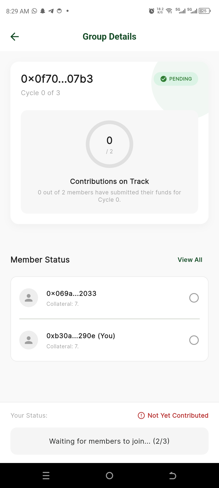
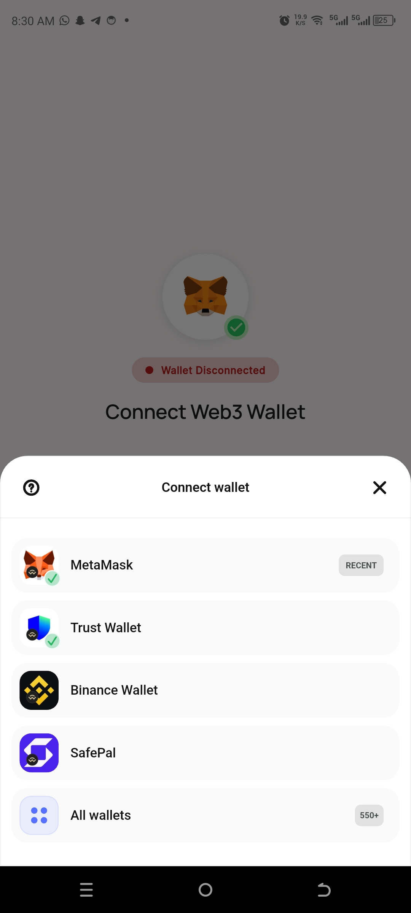
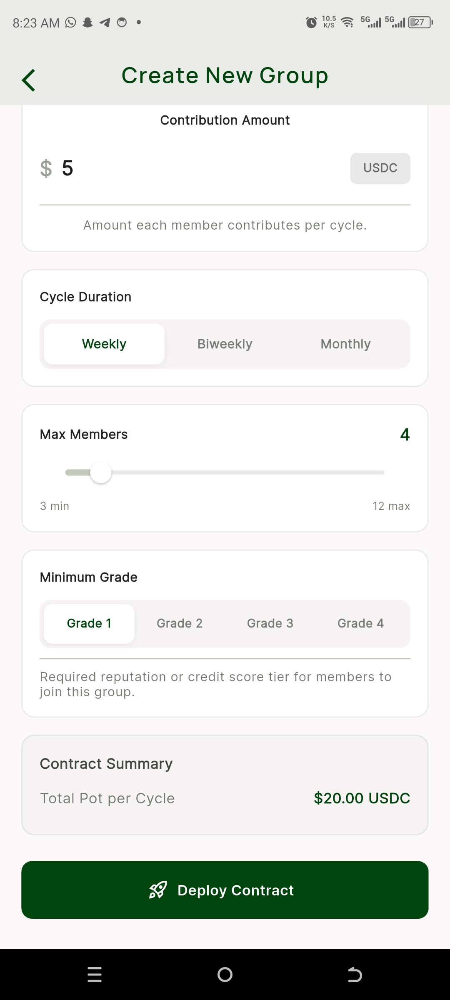
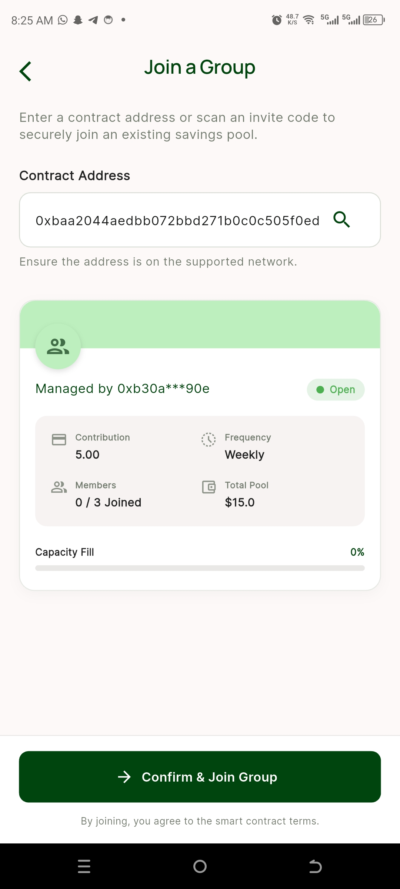

# TakTurns - Decentralized Rotational Savings (ROSCA) App

TakTurns is a Web3-powered Flutter application that allows users to create and participate in rotational savings groups (also known as ROSCAs or Susu). Members can securely pool collateral, contribute to cycles using USDC/ERC20 tokens on-chain, and manage their decentralized finance savings goals collaboratively with other members. 

By leveraging smart contracts, TakTurns removes the need for a centralized custodian and implements trustless mechanisms for enforcing contributions, handling cycle rotations, and penalizing defaulters.

---

## 📸 Screenshots

|                       Wallet Connection                        |                      Home Dashboard                      |                     Group Details                      |
|:--------------------------------------------------------------:|:--------------------------------------------------------:|:------------------------------------------------------:|
|  |  |  |

|                     Wallet Selection                      |                     Create Group                     |                    Join Group                    |
|:---------------------------------------------------------:|:----------------------------------------------------:|:------------------------------------------------:|
|  |  |  |

---

## ✨ Features

- **Web3 Wallet Integration:** Seamlessly log in and authenticate using WalletConnect (via Reown AppKit Modal).
- **Group Management:** Create custom savings groups with customizable cycle durations, max members, contribution amounts, and required collateral.
- **Join Decentralized Pools:** Join pending groups by depositing the required collateral securely on-chain.
- **Real-Time On-Chain Data:** Live, accurate synchronization of group state, member counts, and contribution progress straight from the blockchain.
- **Trustless Execution:** Smart contract rules govern rotations, preventing theft and slashing defaulters automatically.
- **Supabase Indexing:** Faster load times on the Home Dashboard via Supabase Edge Function indexing (with robust on-chain fallbacks).

---

## 🛠 Technologies & Architecture

- **Frontend:** Flutter & Dart
- **State Management:** BLoC (Business Logic Component) Pattern
- **Routing:** GoRouter
- **Web3/Blockchain:** `web3dart` (for contract interaction) & `reown_appkit` (for wallet connection and transaction signing)
- **Database/Indexing:** Supabase (PostgreSQL) for caching member addresses and group creation history.

---

## 🚀 Getting Started

### Prerequisites

- Flutter SDK (latest stable version)
- Dart SDK
- A Supabase Account and Project
- A WalletConnect / Reown Cloud Project ID

### 1. Clone the Repository

```bash
git clone https://github.com/your-username/takturns-flutter-app.git
cd takturns-flutter-app
```

### 2. Configure Environment Variables

You need to provide your Supabase keys and WalletConnect Project ID. 
Update your `lib/main.dart` or `AppConstants` with the following variables:

- `SUPABASE_URL` 
- `SUPABASE_ANON_KEY`
- `WALLET_CONNECT_PROJECT_ID`

*(Note: Depending on your setup, you might want to use `--dart-define` or a `.env` file.)*

### 3. Install Dependencies

```bash
flutter pub get
```

### 4. Run the Application

Connect an Android/iOS emulator or a physical device, and run:

```bash
flutter run
```

---

## 📂 Project Structure

```text
lib/
 ├── core/
 │    ├── constants/       # ABIs, Contract Addresses, App-wide constants
 │    ├── di/              # Dependency Injection (GetIt)
 │    ├── router/          # GoRouter configuration
 │    ├── theme/           # App colors and styling
 │    └── utils/           # Extension methods and formatting utilities
 ├── features/
 │    ├── groups/          # Group Creation, Joining, and Details
 │    ├── home/            # User Dashboard and Group Listing
 │    ├── splash/          # Splash Screen & Initialization
 │    └── wallet/          # WalletConnect Logic
 └── main.dart             # App entry point
```

---

## 🔗 Smart Contracts

This repository contains the frontend application. The TakTurns smart contracts manage all the decentralized logic (escrow, cycle advancement, and slashing). The application interfaces directly with these contracts using their ABIs mapped in `lib/core/constants/abis.dart`.

---

## 📜 License

This project is licensed under the MIT License - see the LICENSE file for details.
